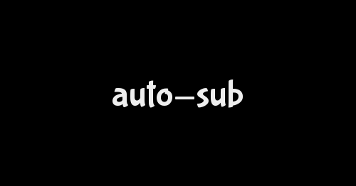

![Release][latest-release]
![Release Date][release-date]
![Language][language]
![License][license]
![Code Size][code-size]

<!-- PROJECT LOGO -->
<br />
<p align="center">
  <a href="https://github.com/demon-rem/auto-sub/">
    
  </a>

  <h3 align="center">auto-sub</h3>

  <p align="center">
    A command-line utility to batch-add subtitles, attachments, chapters and more to media files
    <br><br>
    <a href="https://github.com/demon-rem/auto-sub/"><strong>Explore the docs »</strong></a>
    <br />
    <br />
    <a href="https://github.com/demon-rem/auto-sub/issues">Bug Report</a>
    ·
    <a href="https://github.com/demon-rem/auto-sub/issues">Request a Feature</a>
    ·
    <a href="https://github.com/demon-rem/auto-sub/fork">Fork Repo</a>

  </p>
</p>
<br>

---
<br>

<!-- TABLE OF CONTENTS -->
- [About the project](#about-the-project)
- [Terminology](#terminology)
  - [Extra file vs Media file](#extra-file-vs-media-file)
  - [Source Directory vs Root Directory](#source-directory-vs-root-directory)
  - [Wrap-up](#wrap-up)
- [Installation](#installation)
  - [Compiling from source](#compiling-from-source)
- [Setup](#setup)
  - [Advanced Setup](#advanced-setup)
- [Documentation](#documentation)
    - [Syntax](#syntax)
- [Flags](#flags)
  - [Boolean Flags](#boolean-flags)
    - [Log](#log)
    - [Test](#test)
    - [Version](#version)
    - [Direct](#direct)
    - [Summary](#summary)
  - [Miscellaneous Flags](#miscellaneous-flags)
    - [Root](#root)
    - [Language](#language)
    - [Subtitle](#subtitle)
    - [FFmpeg](#ffmpeg)
    - [FFprobe](#ffprobe)
    - [Exclude](#exclude)
    - [RExclude](#rexclude)
    - [Summary](#summary-1)
- [Advanced Usage](#advanced-usage)
  - [Recognized Extensions](#recognized-extensions)
    - [MediaFiles](#mediafiles)
    - [Subtitles](#subtitles)
    - [Attachments](#attachments)
    - [Chapters](#chapters)
- [License](#license)
- [Roadmap](#roadmap)
- [Forks](#forks)
  - [Deploying a fork](#deploying-a-fork)

## About the project

Auto-sub is simply a command line tool to batch add subtitles, chapters, attachments to media files using [FFmpeg](http://ffmpeg.org).

The final result will be in a matroska (`.mkv`) container containing the original media file, along with subtitles, attachments, chapters, tags, etc.

## Terminology

This section defines the basic terms used in the rest of the project.

### Extra file vs Media file

Media file is the central video file to which the subtitles, attachments, chapters, etc. will be attached. Each source directory should contain **exactly one** media file - the program will throw an error if no media file is found in a directory, or if multiple media files are found!

On the other hand, *extra file* could refer to any other files present in the source directory apart from the media file - this could be a file containing subtitles, attachments, chapters, tags, etc.

### Source Directory vs Root Directory

Any directory containing exactly **one** media file, and *one or more* extra files is a *source directory*. At the most basic level, auto-sub acts upon source directories, locating the media file and extra file(s) present in each source directory, and merging them to make a single file in a matroska container.

Root directory, refers to a parent directory containing multiple source directories. Remember how a source directory could contain only **one** media file? In order to work upon multiple media files at once, place source directories containing media file and extra file(s) inside a parent directory. This parent directory becomes the *root directory*.

As an example;
```    
  /home/User/Movies
    ├── Dir 01
    │   ├── subtitles.ass
    │   ├── Movie 01.mkv
    │   ├── chapters.xml
    │   └── tags.xml
    ├── Dir 02
    │   ├── Subtitles.ass
    │   ├── Movie 02.mkv
    │   ├── chapters.xml
    │   └── tags.xml
```

In the example above, \``/home/User/Movies`\` acts as the *root directory*, this root directory contains two *source directories* inside it; namely, \``Dir 01`\` and \``Dir 02`\`. Each of these source directories further contains a media file (`Movie XX.mkv`), a subtitle file, and accompanying chapters and tags.

**P.S**: Internally, *auto-sub* differentiates (and recognizes) files from their extensions. Head over to [this](#recognized-extensions) section for a list of accepted file extensions.

### Wrap-up

A simple summary for this section;
 - A source directory should have **exactly one** media file
 - A source directory should have **atleast one** extra file
 - Any directory containing **exactly one** media file, and **one or more** extra file(s) is a *source directory*
 - The parent directory containing **one or more** source directories is the *root directory*

## Installation

`Auto-Sub` is a Go program, it can be used directly as a portable binary or executable file.

- [Download](https://github.com/demon-rem/auto-sub/releases) the relevant binary for your system.
- Extract `auto-sub` or `auto-sub.exe` file from the archive
- Run `auto-sub -v` to test

Check out the [documentation](#documentation) for more info on how to use auto-sub.

### Compiling from source

*Note: These instructions are to generate an executable from the source-code by yourself. If you want an easier solution, follow the instructions above to download a pre-compiled executable.*

Make sure you have [Go](https://golang.org/) installed. [Download Go](https://golang.org/dl/) for your system if required.

```bash
git clone https://github.com/demon-rem/auto-sub
cd ./auto-sub
go build

./auto-sub -v
```

The steps above will generate a binary/executable file named `auto-sub` or `auto-sub.exe` by default.

## Setup

Auto-sub uses FFmpeg in the backend. Make sure you have FFmpeg and FFprobe installed before using *auto-sub*

To install FFmpeg or FFprobe, follow the instructions listed [here](https://ffmpeg.org/download.html)

Once done, move over to testing your setup with *auto-sub*;
```
auto-sub --test
```

If everything is in place, *auto-sub* should be able to list out the versions of FFmpeg and FFprobe installed in your system. The output should look something like;

```
[demon-rem@albedo ~]$ auto-sub --test

FFmpeg version found: n4.3.1
FFprobe version found: n4.3.1

```

If *auto-sub* is unable to locate either FFmpeg or FFprobe, an error message will appear instead, or you'll be asked to manually enter path to FFmpeg/FFprobe executables. See the section on [miscellaneous flags](#miscellaneous-flags) for more help on this.

### Advanced Setup

This section explains how to setup `auto-sub` to run it directly from the command prompt (without having to change directories).

- Windows users can add path to the executable as an [environment variable](https://stackoverflow.com/a/64233155/)

- Linux or Mac users can move the binary to `/usr/local/bin` (or `/usr/bin`) to achieve the same result.


## Documentation

#### Syntax

Auto-sub is simply a wrapper over FFmpeg, its syntax is like this;

```bash
auto-sub ["/path/to/root"] [flags]
```

Note: While using *auto-sub*, the only input required is the path to the root (or source) directory. This path can be provided as an argument, **or** through a the [root flag](#miscellaneous-flags).

## Flags

Flags can help you fine-tune the workings of *auto-sub* to match your needs, for example, ignoring a particular file, or ignoring any file that meets a regex pattern, and more.

This section contains a comprehensive list of valid flags for *auto-sub*, their usage, default values, and expected input. Some flags may have a shorthand version in addition to the normal flag - both of these versions can be used interchangably as required.

Note that **all** of these flags are optional - as such, *auto-sub* can work perfectly fine even without them!

### Boolean Flags

All boolean flags are disabled by default, using a boolean flag while running *auto-sub* will enable it.

#### Log

Enables logging, generates a log report for the run. Log files will be helpful to get crash reports, and/or file issues for bugs.

The log file will stored in the current working directory, named `[auto-sub] logs.txt` (run `cwd` in Windows, or `pwd` in Linux/Mac to get the working directory)

#### Test

Test flag exists to explicitly test your setup, this includes attempting to locate FFmpeg and FFprobe executables implicitly, and fetching their versions (if found)

*Note*: *auto-sub* will quit once the test completes, as a result, as such, the test flag can't be used outside uh, running the initial test.

#### Version

Returns the current version of *auto-sub* present in your system.

#### Direct

By default, the path entered is assumed to belong to a root directory (which will internally contain one or more source directories). In case you want to run *auto-sub* for an individual *source directory*, using this flag ensures that the path will be treated as a source directory. 

Also, take a look at [source directory vs root directory](#source-directory-vs-root-directory)

<br>

#### Summary

|    Flag   	| Short-hand 	|                   Purpose                  	|
|:---------:	|------------	|:------------------------------------------:	|
|   --log   	|      -     	|      Generate logs for the current run     	|
|   --test  	|      -     	|      Run test(s) to verify your setup      	|
| --version 	|     -v     	|    Display current version for auto-sub    	|
|   --help  	|     -h     	|          Display help for auto-sub         	|
|  --direct 	|      -     	| Treat root directory as a source directory 	|
|           	|            	|                                            	|

<br>

### Miscellaneous Flags

Flags that require a value while being used.

#### Root

Path to *root directory*. Note that path to root directory can also be passed in as an argument. 

It is recommended to use this flag if you're creating a bash/batch script wrapper around *auto-sub*, passing path to the root directory as an argument *may* be deprecated/modified in the future.

#### Language

Dictates the language code for subtitle files. Among other things, this will be used by mediaplayers to select/ignore a subtitle stream based on user preferences. The default value for this flag is "*eng*" (language code for English).[Here](https://en.wikipedia.org/wiki/List_of_ISO_639-1_codes) is a comprehensive list of langauge codes.

*Note*: The same language code will be applied to all subtitle streams.

#### Subtitle

Sets the title for the subtitle stream. If a value for this flag is not provided, the filename of the subtitle file (minus the file extension) will be used by default.

*Note*: The same title will be applied to all subtitle streams, in every source directory.

#### FFmpeg

path to FFmpeg executable. This will be the binary file for Linux, and `.exe` file for Windows users. For most users, *auto-sub* should be able to implicitly fill this value during runtime.

This flag can be used to modify the default value, or to manually enter the path to FFmpeg in case *auto-sub* is unable to locate it.

#### FFprobe

Similar to the `ffmpeg` flag, this flag sets the path to the FFprobe executable. Again, for most users, *auto-sub* should be able to implicitly populate this value during runtime.

This flag can be used to modify the default value, or manually select the path to FFprobe in case *auto-sub* is unable to locate it.

#### Exclude

Explicitly mark out files to be ignored using their names - note that files with [unrecognized extensions](#recognized-extensions) are always ignored.

If the name of a file (inclusive of extension), matches a value present in this list, the file will be ignored by *auto-sub*.

#### RExclude

Short for regex-exclude, this flag ignores any file that matches a regular expression. The regex syntax needs to be in accordance with [RE2](https://en.wikipedia.org/wiki/RE2_(software)).

[Here](https://github.com/google/re2/wiki/Syntax) is a simple cheatsheet for RE2 regex syntax

<br>

#### Summary

| Flag       	| Short-hand 	| Expected Value  	| Purpose                                          	| Default Value     	| Required 	|
|------------	|------------	|-----------------	|--------------------------------------------------	|-------------------	|----------	|
| --root     	| none       	| String          	| Path to the root directory                       	| -                 	| No       	|
| --language 	| -l         	| String          	| Language code to be used with subtitles (if any) 	| "eng"             	| No       	|
| --subtitle 	| none       	| String          	| Custom title to be used for the subtitle files   	| -                 	| No       	|
| --ffmpeg   	| none       	| String          	| Path to FFmpeg binary/executable                 	| Runtime Dependent 	| Yes      	|
| --ffprobe  	| none       	| String          	| Path to FFprobe binary/executable                	| Runtime Dependent 	| Yes      	|
| --exclude  	| -E         	| List of strings 	| List of file names to be ignored                 	| -                 	| No       	|
| --rexclude 	| none       	| String          	| String containing regex pattern to ignore files  	| -                 	| No       	|

## Advanced Usage

### Recognized Extensions

Internally, auto-sub differentiates between file types using their extensions. This section contains a comprehensive list of file extensions recognized by auto-sub, and the category these files are recongized as.

Files with unrecognized extensions will be *ignored* by auto-sub. Alternatively, select files can be delibrately ignored due to ignore rules (ignore rules can be set using [flags](#miscellaneous-flags))

#### MediaFiles
Supported file extensions;
 - `.mkv`
 - `.mp4`
 - `.webm`
 - `.m2ts`

#### Subtitles

Supported file extensions;

 - `.srt`
 - `.ass`
 - `.sup`
 - `.pgs`
 - `.vtt`

#### Attachments

Supported file extensions;
 - `.ttf`
 - `.otf`

#### Chapters

Supported file extensions;
 - `.xml`

## License

Distributed under the MIT License. See [LICENSE](./LICENSE) for details.

## Roadmap

The main aim for this project is to act as a wrapper over FFmpeg - allowing users to soft sub (even multiple) files at once, without having to trudge through pages of documentation to learn the basics of FFmpeg.

A large part of this functionality is already present in the program, nevertheless, this section attempts to list out features that *may* be added in the future. Note that none of these features are intended to break/modify the existing functionality of auto-sub, rather add to what already exists, and simplify where possible.

***A list of possible improvements;***
 - Silent mode
 - Interactive mode
 - Config file (no gurantees)
 - Force flag (overwrite existing files - if any)
 - Custom naming for output files

## Forks

Custom forks of this project are **not** supported. While anyone is free to fork the project, issues pertaining to custom forks will not be supported - essentially, once you fork the project, you are on your own.

Have a suggestion/feature in your mind that ins't listed here? Feel free to [file an issue](https://github.com/demon-rem/auto-sub/issues) :)

### Deploying a fork

While deploying a fork on Github, make sure to generate a Codecov token, and add it as a secret named `CODECOV_TOKEN` to your forked repository.

Alternatively, you may remove Codecov action from `.github/workflows/testing.yml` file to disable Codecov reports for your fork.

<br>

* [Creating Github Secrets](https://docs.github.com/en/actions/reference/encrypted-secrets)

* [Generating Codecov Token](https://docs.codecov.io/docs/quick-start)

[code-size]: https://img.shields.io/github/languages/code-size/demon-rem/auto-sub?style=for-the-badge
[language]: https://img.shields.io/github/languages/top/demon-rem/auto-sub?style=for-the-badge
[license]: https://img.shields.io/github/license/demon-rem/auto-sub?style=for-the-badge
[latest-release]: https://img.shields.io/github/v/release/demon-rem/auto-sub?style=for-the-badge
[release-date]: https://img.shields.io/github/release-date/demon-rem/auto-sub?style=for-the-badge
[issues-url]: https://img.shields.io/github/issues-raw/demon-rem/auto-sub?style=for-the-badge
