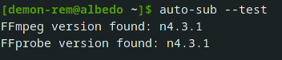

![Release][latest-release]
![Release Date][release-date]
![Language][language]
![License][license]
![Code Size][code-size]

<!-- PROJECT LOGO -->
<br />
<p align="center">
  <a href="https://github.com/demon-rem/auto-sub/">
    
  </a>

  <h3 align="center">auto-sub</h3>

  <p align="center">
    A command-line utility to batch-add subtitles to media files
    <br><br>
    <a href="https://github.com/demon-rem/auto-sub/"><strong>Explore the docs »</strong></a>
    <br />
    <br />
    <a href="https://github.com/demon-rem/auto-sub/issues">Bug Report</a>
    ·
    <a href="https://github.com/demon-rem/auto-sub/issues">Request a Feature</a>
    ·
    <a href="https://github.com/demon-rem/auto-sub/fork">Fork Repo</a>

  </p>
</p>
<br>

---
<br>

<!-- TABLE OF CONTENTS -->
- [About the project](#about-the-project)
- [Terminology](#terminology)
  - [Extra file vs Media file](#extra-file-vs-media-file)
  - [Source Directory vs Root Directory](#source-directory-vs-root-directory)
- [Installation](#installation)
  - [Compiling from source](#compiling-from-source)
- [Setup](#setup)
  - [Advanced Setup](#advanced-setup)
- [Documentation](#documentation)
    - [Syntax](#syntax)
  - [Flags](#flags)
  - [Boolean Flags](#boolean-flags)
  - [Miscellaneous Flags](#miscellaneous-flags)
- [Advanced Usage](#advanced-usage)
  - [Recognized Extensions](#recognized-extensions)
    - [MediaFiles](#mediafiles)
    - [Subtitles](#subtitles)
    - [Attachments](#attachments)
    - [Chapters](#chapters)
- [License](#license)
- [Roadmap](#roadmap)
- [Forks](#forks)
  - [Deploying a fork](#deploying-a-fork)

## About the project

A command line tool to batch add subtitles, chapters, attachments to media files using [FFmpeg](http://ffmpeg.org).

The final result will be present inside a matroska (`.mkv`) container.

## Terminology

This section defines the basic terms used in the rest of the project.

### Extra file vs Media file

Media file is the central video file to which the subtitles, attachments, chapters, etc. will be attached. Each source directory should contain exactly **one** media file - the program will fail if no media file could be found, or if multiple media files were found!

On the other hand, *extra file* refers to any other file involved apart from the media file - this could be a file containing subtitles, attachments, chapters, tags, etc.

### Source Directory vs Root Directory

Source directory is a directory containing exactly **one** media file, and *one or more* extra files. At the most basic level, auto-sub acts upon source directories, locating the media file and extra file(s) present in each source directory, and combining them together using FFmpeg.

Root directory, refers to a parent directory containing multiple source directories. Remember how a source directory could contain only **one** media file? In order to soft sub multiple media files at once, simply create source directories containing the media file, and extra files - and place all these source directories inside a parent directory. This parent directory becomes the *root directory*.

As an example;
```    
  /home/User/Movies
    ├── Dir 01
    │   ├── subtitles.ass
    │   ├── Movie 01.mkv
    │   ├── chapters.xml
    │   └── tags.xml
    ├── Dir 02
    │   ├── Subtitles.ass
    │   ├── Movie 02.mkv
    │   ├── chapters.xml
    │   └── tags.xml
```

In the example above, \``/home/User/Movies`\` acts as the [*root* directory](#root-directory), this root directory contains two [source directories](#source-directory) inside it; namely, \``Dir 01`\` and \``Dir 02`\`.

And each of these source directories further contains a media file (`Movie XX.mkv`), a subtitle file, and accompanying chapters and tags.

**P.S**: The program differentiates (and recognizes) files through their extensions. Head over to [this](#recognized-extensions) section for a list of accepted file extensions.

## Installation

`Auto-sub` is a Go program, it can be installed as a simple binary or an executable file.

- [Download](https://github.com/demon-rem/auto-sub/releases) the relevant binary for your system.
- Extract `auto-sub` or `auto-sub.exe` file from the archive
- Run `auto-sub -v` to test

Check out the [documentation](#documentation) for more info on how to use auto-sub.

### Compiling from source

Note: These instructions are to generate an executable from the source-code by yourself. If you want an easier solution, check out the [installation section](#installation) to download a pre-compiled executable.

Make sure you have [Go](https://golang.org/) installed. [Download Go](https://golang.org/dl/) for your system if required.

```bash
git clone https://github.com/demon-rem/auto-sub
cd ./auto-sub
go build

./auto-sub -v
```

This will leave you with a checked out version of `auto-sub` that you can 

## Setup

Auto-sub uses FFmpeg in the backend to modify the media files. Make sure you have FFmpeg and FFprobe installed in your system in order to use auto-sub.

Get pre-complied binaries and installation instructions for FFmpeg and FFprobe [here](https://ffmpeg.org/download.html)

Once done, move over to testing your setup;
```
auto-sub --test
```

If everything is in place, *auto-sub* should be able to list out the versions of FFmpeg and FFprobe installed in your system. The output should look something like;



If *auto-sub* is unable to locate either FFmpeg or FFprobe, an error message will appear instead. In this case, you can manually point out the path to FFmpeg/FFprobe executables to *auto-sub*. See the section on [miscellaneous flags](#miscellaneous-flags) for more help on this

### Advanced Setup

This section explains how to setup `auto-sub` to run it directly from the command prompt (without having to change directories).

- Windows users can add path to the executable as an [environment variable](https://stackoverflow.com/a/64233155/)

- Linux or Mac users can move the binary to `/usr/local/bin` (or `/usr/bin`) to achieve the same result.


## Documentation

#### Syntax

Auto-sub is simply a wrapper over FFmpeg, its syntax is like this;

```bash
auto-sub ["/path/to/root"] [flags]
```

Note: In the command, the only part required is the path to the root (or source) directory. This path can be provided as an argument, **or** through a the [root flag](#miscellaneous-flags).

### Flags

Flags can help you fine-tune the workings of *auto-sub* to match your requirements, for example as ignoring a particular file, or ignoring any file that meets a regex pattern, and more.

This section is a comprehensive list of valid flags for *auto-sub*. Some flags have two different versions, i.e. the normal flag, and a shorthand version - both of these versions can be used interchangably as required.

Note that **all** of these flags are optional - as such, auto-sub can work perfectly fine even without them!

### Boolean Flags

All boolean flags are disabled by default.

|    Flag   	| Short-hand 	|                     Purpose                    	|
|:---------:	|------------	|:----------------------------------------------:	|
|   --log   	|    none    	|        Generate logs for the current run       	|
|   --test  	|    none    	|        Run test(s) to verify your setup        	|
| --version 	|     -v     	|      Display current version for auto-sub      	|
|   --help  	|     -h     	|            Display help for auto-sub           	|
|  --direct 	|    none    	| Treat the root directory as a source directory 	|

<br>

### Miscellaneous Flags

Flags that require a value.

|    Flag    	| Short-hand 	| Expected Value  	| Purpose                                          	| Default Value                      	| Required 	|
|:----------:	|------------	|-----------------	|--------------------------------------------------	|------------------------------------	|:--------:	|
|   --root   	|    none    	|      String     	| Path to the root directory                       	|                none                	|    No    	|
| --language 	|     -l     	|      String     	| Language code to be used with subtitles (if any) 	|                "eng"                	|    No    	|
| --subtitle 	|    none    	|      String     	| Custom title to be used for the subtitle files   	| Original name of the subtitle file 	|    No    	|
|  --ffmpeg  	|    none    	|      String     	| Path to FFmpeg binary/executable                 	|         Decided at runtime         	|    Yes   	|
|  --ffprobe 	|    none    	|      String     	| Path to FFprobe binary/executable                	|         Decided at runtime         	|    Yes   	|
|  --exclude 	|     -E     	| List of strings 	| List of file names to be ignored                 	|                none                	|    No    	|
| --rexclude 	|    none    	|      String     	| String containing regex pattern to ignore files  	|                none                	|    No    	|


***Important***
For most users, the flags `--ffmpeg` and `--ffprobe` will be filled during runtime. In case you don't have FFmpeg *or* FFprobe installed, or *auto-sub* was unable to locate them, you'll be asked to manually feed the value to their executables.

## Advanced Usage

### Recognized Extensions

Internally, auto-sub differentiates between file types using their extensions. This section contains a comprehensive list of file extensions recognized by auto-sub, and the category these files are recongized as.

Files with unrecognized extensions will be *ignored* by auto-sub. Alternatively, select files can be delibrately ignored due to ignore rules (ignore rules can be set using [flags](#miscellaneous-flags))

#### MediaFiles
Supported file extensions;
 - `.mkv`
 - `.mp4`
 - `.webm`
 - `.m2ts`

#### Subtitles

Supported file extensions;

 - `.srt`
 - `.ass`
 - `.sup`
 - `.pgs`
 - `.vtt`

#### Attachments

Supported file extensions;
 - `.ttf`
 - `.otf`

#### Chapters

Supported file extensions;
 - `.xml`

## License

Distributed under the MIT License. See [LICENSE](./LICENSE) for details.

## Roadmap

The main aim for this project is to act as a wrapper over FFmpeg - allowing users to soft sub (even multiple) files at once, without having to trudge through pages of documentation to learn the basics of FFmpeg.

A large part of this functionality is already present in the program, nevertheless, this section attempts to list out features that *may* be added in the future. Note that none of these features are intended to break/modify the existing functionality of auto-sub, rather add to what already exists, and simplify where possible.

***A list of possible improvements;***
 - Silent mode
 - Interactive mode
 - Config file (no gurantees)
 - Force flag (overwrite existing files - if any)
 - Custom naming for output files

## Forks

Custom forks of this project are **not** supported. While anyone is free to fork the project, issues pertaining to custom forks will not be supported - essentially, once you fork the project, you are on your own.

Have a suggestion/feature in your mind that ins't listed here? Feel free to [file an issue](https://github.com/demon-rem/auto-sub/issues) :)

### Deploying a fork

While deploying a fork on Github, make sure to generate a Codecov token, and add it as a secret named `CODECOV_TOKEN` to your forked repository.

Alternatively, you may remove Codecov action from `.github/workflows/testing.yml` file to disable Codecov reports for your fork.

<br>

* [Creating Github Secrets](https://docs.github.com/en/actions/reference/encrypted-secrets)
<br>
* [Generating Codecov Token](https://docs.codecov.io/docs/quick-start)

[code-size]: https://img.shields.io/github/languages/code-size/demon-rem/auto-sub?style=for-the-badge
[language]: https://img.shields.io/github/languages/top/demon-rem/auto-sub?style=for-the-badge
[license]: https://img.shields.io/github/license/demon-rem/auto-sub?style=for-the-badge
[latest-release]: https://img.shields.io/github/v/release/demon-rem/auto-sub?style=for-the-badge
[release-date]: https://img.shields.io/github/release-date/demon-rem/auto-sub?style=for-the-badge
[issues-url]: https://img.shields.io/github/issues-raw/demon-rem/auto-sub?style=for-the-badge
